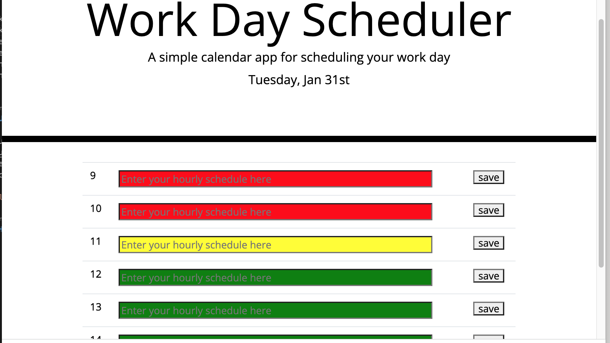

# Work-Day-Scheduler

Work-Day-Scheduler is an application for standard daily work hour schedule that uses color-code for each timeblock based on past, present, and future when the timeblock is viewed. It allow a user to enter an event when they click a coloured timeblock, and save the event in local storage when the save button is clicked for each timeblock.

## Usage

To use this app, copy and paste this url("https://hoduola5.github.io/Work-Day-Scheduler/") to google, enter an event by clicking a coloured timeblock, and click the save button to save and view latter.

## How to Contribute

I'm open to suggestion on how to make it better.
